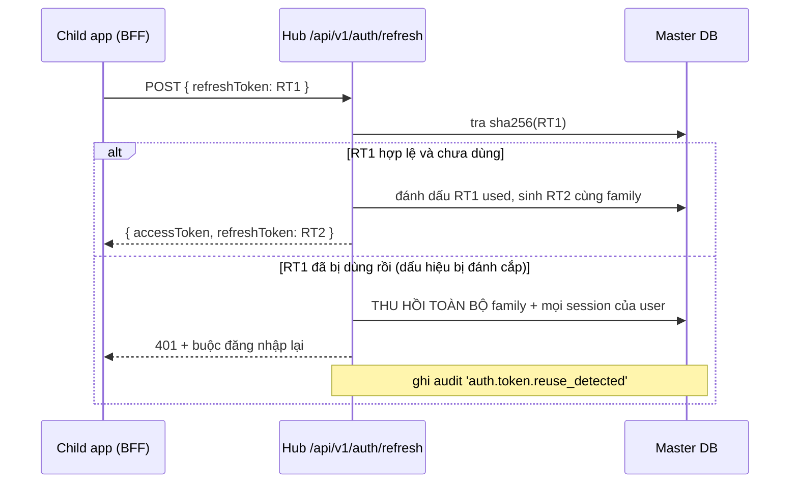

# IAM Blueprint — Identity Plane của Unified-App-Infra

| Field | Value |
|---|---|
| Version | v0.1 (draft, 2026-09-13) |
| Trạng thái | Thiết kế — chưa cài đặt (Phase 5 trở đi) |
| Dựa trên | Quyết định của Khoi ngày 2026-09-13 về 3 nhóm danh tính, cross-domain Bearer, 2-tier mở |

> **Đọc file này khi nào:** trước khi động vào bất cứ thứ gì liên quan tới đăng nhập, phân quyền,
> token, hay khoá API. `tech.md` mô tả hệ thống *hiện có*; file này mô tả Identity Plane *sẽ có*.

---

## 0. Ba mặt phẳng danh tính (Identity Planes)

Mỗi nhóm có luồng xác thực, kiểu credential và bề mặt tấn công **khác hẳn nhau**. Trộn chung là
nguồn gốc của phần lớn lỗ hổng IAM trong thực tế.

| # | Nhóm | Ai | Xác thực bằng | Đăng ký tự do? | Lưu ở đâu |
|---|---|---|---|---|---|
| **P0** | Platform Super Admin | Khoi + 2-3 dev | Email trong allowlist + MFA **bắt buộc** | ❌ không | `user` + `infra_platform_admins` |
| **P1** | Child App End-User | Sinh viên, người dùng B2C | Email/Password, Google, GitHub, Passkey | ✅ có, theo từng app | `user` + `infra_app_members` (gắn `app_id`) |
| **P2** | Machine / Service Account | CI/CD, cron, AI agent, backend app con | `sk_live_…` hoặc OAuth2 client_credentials | ❌ do admin cấp | `infra_service_accounts` + `infra_api_keys` |

**Bất biến sống còn:** một `user` là danh tính toàn cục (một email = một hàng trong `user`), nhưng
**quyền truy cập luôn là (user × app)**. Không có khái niệm "user của nền tảng" ở tầng dữ liệu app con.
Session/token luôn mang `app_id`, và `app_id` **luôn** lấy từ credential đã xác thực, không bao giờ
từ body/header do client gửi.

### 0.1 Vì sao Super Admin phải tách hẳn

Nếu Super Admin và end-user dùng chung một bảng quyền, chỉ cần một lỗi logic trong RBAC là một
sinh viên leo thang thành quản trị hạ tầng — và hạ tầng đó nắm **khoá giải mã connection string của
mọi app**. Tách bằng ba lớp độc lập:

1. Email phải nằm trong `INFRA_SUPER_ADMIN_EMAILS` (biến môi trường, không sửa được qua UI).
   Hiện tại: `minkoi007.cs@gmail.com`. Nhiều admin thì ngăn cách bằng dấu phẩy.
2. Phải có hàng trong `infra_platform_admins` với `status = 'active'`.
3. MFA bắt buộc; phiên admin TTL ngắn (8h) và bắt re-auth trước thao tác nhạy cảm.

Cả ba đều phải đúng. Thiếu một là từ chối.

---

## 1. Kiến trúc token cross-domain (thay thế cookie)

### 1.1 Vì sao không dùng cookie

App con chạy ở domain bất kỳ (`*.vercel.app`, `*.pages.dev`, custom domain). Cookie của hub gửi từ
domain khác là **third-party cookie**: Safari ITP chặn từ 2020, Chrome đang loại bỏ. Xây SSO trên
nền đó là xây trên cát.

### 1.2 Ba kiểu token

| Token | Dạng | TTL | Nơi sống | Dùng để |
|---|---|---|---|---|
| **Access token** | JWT ký ES256 | **10 phút** | RAM (client) hoặc server app con | Gọi Data API / `/api/v1/*` |
| **Refresh token** | chuỗi ngẫu nhiên 256-bit, **lưu dạng hash** | 30 ngày, xoay mỗi lần dùng | httpOnly cookie *của app con* (BFF) hoặc secure storage | Đổi lấy access token mới |
| **Service key** | `sk_live_…` (SHA-256) | không hết hạn (có thể đặt) | Biến môi trường phía server | M2M, backend app con |

Access token ngắn hạn là thứ chịu đựng được rò rỉ; refresh token dài hạn thì không — nên nó phải
xoay vòng và có phát hiện tái sử dụng.

### 1.3 Claims của access token

```jsonc
{
  "iss": "https://infra.example.com",
  "sub": "user_01HZ...",           // hoặc "svc_01HZ..." cho service account
  "aud": "app_01HZ...",            // app_id — token của app A vô dụng với app B
  "sid": "sess_01HZ...",           // để thu hồi theo phiên
  "typ": "access",
  "scope": ["db:read", "db:write"],
  "roles": ["member"],             // role trong phạm vi app này
  "wid": null,                     // workspace_id — null ở giai đoạn cá nhân
  "act": null,                     // actor khi impersonation (RFC 8693)
  "amr": ["pwd", "otp"],           // cách đã xác thực — để enforce step-up
  "iat": 1789000000,
  "exp": 1789000600,
  "jti": "tok_01HZ..."
}
```

`aud = app_id` là hàng rào chống nhầm lẫn app quan trọng nhất: middleware **phải** kiểm `aud` khớp
với app mà endpoint đang phục vụ, nếu không token của app A dùng được ở app B.

### 1.4 Xoay vòng refresh token + phát hiện tái sử dụng



Không có bước này thì refresh token bị đánh cắp = kẻ tấn công ở lại vĩnh viễn mà không ai biết.

### 1.5 Nơi cất token phía client — khuyến nghị mạnh

Khoi viết "Memory / Web Storage an toàn". Nói thẳng: **`localStorage` không an toàn trước XSS** —
một script lạ đọc được token là xong. Thứ tự ưu tiên:

1. **BFF (khuyến nghị)** — app con là Next.js, tức là *có server*. Refresh token nằm ở server app con,
   trình duyệt chỉ giữ cookie first-party của chính app đó. Token không bao giờ chạm JavaScript.
   `@infra/sdk` cung cấp `createServerClient()` cho luồng này.
2. **Access token trong RAM + refresh qua BFF** — cho phần client-side cần gọi trực tiếp.
3. **Refresh token trong `localStorage`** — chỉ khi app con là SPA tĩnh không có server. Bắt buộc kèm
   xoay vòng + phát hiện tái sử dụng + TTL ngắn (7 ngày). Ghi rõ trong tài liệu là phương án yếu nhất.

### 1.6 Quản lý khoá ký

- Cặp khoá ES256, lưu ở `infra_signing_keys` (private key **được mã hoá bằng AES-256-GCM** như
  connection string).
- Công khai qua `GET /.well-known/jwks.json`, có `kid`.
- Xoay 90 ngày: sinh khoá mới → ký bằng khoá mới → giữ khoá cũ trong JWKS thêm 24h (bằng TTL access
  token × 2) → xoá.

---

## 2. Kiểm kê 12 yếu tố IAM

Trạng thái so với code hiện tại (v0.3.0):

| # | Yếu tố | Hiện có | Thiếu | Phase |
|---|---|---|---|---|
| 1 | **SSO** | Better Auth session cookie trên hub | Token cross-domain, `/authorize`, SSO giữa các app con | 5 |
| 2 | **MFA / Multiple MFA** | ❌ | TOTP, backup codes, WebAuthn làm yếu tố 2, nhiều yếu tố/user, step-up, trusted device | 5 |
| 3 | **Passwordless / Passkey** | ❌ | WebAuthn đăng ký + đăng nhập, discoverable credentials, magic link, email OTP | 5 |
| 4 | **OAuth2 / OIDC / SAML** | Hub là *client* (Google/GitHub/MS) ✅ | Hub là *provider*: `/authorize`, `/token`, JWKS, discovery, PKCE, consent, `infra_oauth_clients`. SAML/SCIM **hoãn** theo quyết định của Khoi | 5 |
| 5 | **RBAC + ABAC** | Scope trên API key (`db:read`…) + role thô trong `infra_app_members` | Catalog permission, role theo phạm vi, gán role, engine ABAC, `check()` API, decision log | 5 |
| 6 | **Org / Tenant / Dept / Team** | `infra_apps` (cấp 1) | `workspaces` + `workspace_members`, `workspace_id` NULLABLE khắp nơi | 5 (schema) / 8 (UI) |
| 7 | **User lifecycle** | Tạo user qua đăng ký | Mời, chuyển workspace, vô hiệu hoá, offboard (thu hồi mọi session + token), soft delete + purge, máy trạng thái | 5 |
| 8 | **Service account** | API key gắn app | `infra_service_accounts` (chủ sở hữu, vòng đời), grant `client_credentials`, token ngắn hạn thay khoá tĩnh | 5 |
| 9 | **API key / token** | `pk_live_` + SHA-256 + scope + rotate/revoke ✅ | **Tách `pk_` / `sk_`** (xem §4.1), IP allowlist, hạn dùng, thống kê, introspection/revocation | 5 |
| 10 | **Delegation / impersonation** | ❌ | Phiên impersonation có lý do + hạn giờ + banner + audit, claim `act`, cấm thao tác nhạy cảm | 6 |
| 11 | **Session & device** | Session Better Auth, chưa có UI | Danh sách thiết bị, thu hồi từng phiên/tất cả, giới hạn phiên đồng thời, idle + absolute timeout, cảnh báo đăng nhập lạ | 5 |
| 12 | **Audit** | `infra_audit_logs` ✅ (dùng fingerprint, không lưu giá trị) | Sự kiện identity, decision log của ABAC, chuỗi hash chống sửa (tuỳ chọn) | 5 |

### 2.1 Những thứ không nằm trong danh sách nhưng IAM thật buộc phải có

Bỏ qua mấy cái này là chỗ hệ thống bị đánh thủng, không phải ở SSO hay SAML:

- **Luồng khôi phục tài khoản** — thống kê thực tế: đây là đường vào dễ nhất. Token dùng một lần,
  hết hạn 15 phút, vô hiệu mọi session sau khi đổi mật khẩu, không tiết lộ email có tồn tại hay không.
- **Chống dò mật khẩu** — khoá theo (IP, email) tăng dần, CAPTCHA sau N lần, đồng hồ so sánh
  constant-time, và **không** cho biết sai email hay sai mật khẩu.
- **Kiểm mật khẩu đã lộ** — HaveIBeenPwned qua k-anonymity (gửi 5 ký tự đầu của SHA-1). Chặn được
  nhồi credential tốt hơn mọi quy tắc "phải có ký tự đặc biệt".
- **Xác minh email trước khi cấp quyền** — hiện `requireEmailVerification` chỉ bật ở production.
- **Webhook sự kiện identity** — app con cần biết user bị xoá/đổi email để dọn dữ liệu của mình.
- **Bảo vệ khoá chủ** — `INFRA_MASTER_ENCRYPTION_KEY` hiện nằm trong `.env.local`. Lên production
  phải là envelope encryption với KMS, hoặc ít nhất là secret manager của nền tảng hosting.

---

## 3. Schema bổ sung (Phase 5)

```ts
// ─── P0: Super admin ────────────────────────────────────────────────────────
export const infraPlatformAdmins = pgTable('infra_platform_admins', {
  userId: text('user_id').primaryKey().references(() => user.id, { onDelete: 'cascade' }),
  role: varchar('role', { length: 24 }).notNull().$type<'super_admin' | 'support' | 'auditor'>(),
  status: varchar('status', { length: 16 }).notNull().default('active'),
  mfaEnforcedAt: timestamp('mfa_enforced_at', { withTimezone: true }),
  createdAt: timestamp('created_at', { withTimezone: true }).notNull().defaultNow(),
});

// ─── Token ──────────────────────────────────────────────────────────────────
export const infraRefreshTokens = pgTable('infra_refresh_tokens', {
  id: uuid('id').primaryKey().defaultRandom(),
  tokenHash: varchar('token_hash', { length: 64 }).notNull().unique(),  // sha256, KHÔNG lưu raw
  familyId: uuid('family_id').notNull(),        // cả họ bị thu hồi khi phát hiện tái sử dụng
  userId: text('user_id').notNull().references(() => user.id, { onDelete: 'cascade' }),
  appId: uuid('app_id').notNull().references(() => infraApps.id, { onDelete: 'cascade' }),
  sessionId: text('session_id').notNull(),
  usedAt: timestamp('used_at', { withTimezone: true }),
  revokedAt: timestamp('revoked_at', { withTimezone: true }),
  revokedReason: varchar('revoked_reason', { length: 32 }),  // 'rotated' | 'reuse' | 'logout' | 'offboard'
  expiresAt: timestamp('expires_at', { withTimezone: true }).notNull(),
  userAgent: text('user_agent'),
  ipAddress: varchar('ip_address', { length: 45 }),
  createdAt: timestamp('created_at', { withTimezone: true }).notNull().defaultNow(),
}, (t) => [index('infra_rt_family_idx').on(t.familyId), index('infra_rt_user_idx').on(t.userId)]);

export const infraSigningKeys = pgTable('infra_signing_keys', {
  kid: varchar('kid', { length: 32 }).primaryKey(),
  algorithm: varchar('algorithm', { length: 16 }).notNull().default('ES256'),
  publicKeyJwk: jsonb('public_key_jwk').$type<Record<string, unknown>>().notNull(),
  encryptedPrivateKey: text('encrypted_private_key').notNull(),   // AES-256-GCM
  encryptionIv: varchar('encryption_iv', { length: 24 }).notNull(),
  encryptionAuthTag: varchar('encryption_auth_tag', { length: 32 }).notNull(),
  status: varchar('status', { length: 16 }).notNull().default('active'), // active | retiring | retired
  notBefore: timestamp('not_before', { withTimezone: true }).notNull().defaultNow(),
  retiresAt: timestamp('retires_at', { withTimezone: true }),
});

// ─── MFA & passkey ──────────────────────────────────────────────────────────
export const infraMfaFactors = pgTable('infra_mfa_factors', {
  id: uuid('id').primaryKey().defaultRandom(),
  userId: text('user_id').notNull().references(() => user.id, { onDelete: 'cascade' }),
  type: varchar('type', { length: 16 }).notNull().$type<'totp' | 'webauthn' | 'backup_code' | 'email_otp'>(),
  label: varchar('label', { length: 64 }).notNull(),
  encryptedSecret: text('encrypted_secret'),      // TOTP seed — mã hoá như mọi secret khác
  encryptionIv: varchar('encryption_iv', { length: 24 }),
  encryptionAuthTag: varchar('encryption_auth_tag', { length: 32 }),
  credentialId: text('credential_id'),            // WebAuthn
  publicKey: text('public_key'),
  signCount: integer('sign_count').default(0),
  transports: jsonb('transports').$type<string[]>(),
  isPrimary: boolean('is_primary').notNull().default(false),
  verifiedAt: timestamp('verified_at', { withTimezone: true }),
  lastUsedAt: timestamp('last_used_at', { withTimezone: true }),
  createdAt: timestamp('created_at', { withTimezone: true }).notNull().defaultNow(),
}, (t) => [index('infra_mfa_user_idx').on(t.userId)]);

export const infraTrustedDevices = pgTable('infra_trusted_devices', {
  id: uuid('id').primaryKey().defaultRandom(),
  userId: text('user_id').notNull().references(() => user.id, { onDelete: 'cascade' }),
  deviceHash: varchar('device_hash', { length: 64 }).notNull(),
  label: varchar('label', { length: 96 }),
  trustedUntil: timestamp('trusted_until', { withTimezone: true }).notNull(),
  lastSeenAt: timestamp('last_seen_at', { withTimezone: true }),
});

// ─── RBAC + ABAC ────────────────────────────────────────────────────────────
export const infraRoles = pgTable('infra_roles', {
  id: uuid('id').primaryKey().defaultRandom(),
  appId: uuid('app_id').references(() => infraApps.id, { onDelete: 'cascade' }), // null = role hệ thống
  key: varchar('key', { length: 48 }).notNull(),          // 'owner' | 'admin' | 'member' | tự đặt
  name: varchar('name', { length: 96 }).notNull(),
  permissions: jsonb('permissions').$type<string[]>().notNull().default([]),  // 'notes:read', 'notes:*'
  isSystem: boolean('is_system').notNull().default(false),
}, (t) => [uniqueIndex('infra_roles_app_key').on(t.appId, t.key)]);

export const infraRoleAssignments = pgTable('infra_role_assignments', {
  id: uuid('id').primaryKey().defaultRandom(),
  subjectType: varchar('subject_type', { length: 16 }).notNull().$type<'user' | 'service_account'>(),
  subjectId: text('subject_id').notNull(),
  roleId: uuid('role_id').notNull().references(() => infraRoles.id, { onDelete: 'cascade' }),
  scopeType: varchar('scope_type', { length: 16 }).notNull().$type<'platform' | 'app' | 'workspace'>(),
  scopeId: text('scope_id'),
  expiresAt: timestamp('expires_at', { withTimezone: true }),   // quyền tạm thời tự hết hạn
  grantedBy: text('granted_by').notNull(),
  createdAt: timestamp('created_at', { withTimezone: true }).notNull().defaultNow(),
}, (t) => [index('infra_ra_subject_idx').on(t.subjectType, t.subjectId)]);

export const infraPolicies = pgTable('infra_policies', {          // phần ABAC
  id: uuid('id').primaryKey().defaultRandom(),
  appId: uuid('app_id').notNull().references(() => infraApps.id, { onDelete: 'cascade' }),
  resource: varchar('resource', { length: 64 }).notNull(),        // tên bảng ở tenant DB
  action: varchar('action', { length: 16 }).notNull().$type<'select' | 'insert' | 'update' | 'delete'>(),
  effect: varchar('effect', { length: 8 }).notNull().$type<'allow' | 'deny'>(),
  condition: jsonb('condition').$type<PolicyCondition>().notNull(),  // xem §5
  priority: integer('priority').notNull().default(100),
  enabled: boolean('enabled').notNull().default(true),
});

// ─── Workspace (2-tier mở, workspace_id NULLABLE ở mọi nơi) ─────────────────
export const infraWorkspaces = pgTable('infra_workspaces', {
  id: uuid('id').primaryKey().defaultRandom(),
  appId: uuid('app_id').notNull().references(() => infraApps.id, { onDelete: 'cascade' }),
  slug: varchar('slug', { length: 63 }).notNull(),
  name: varchar('name', { length: 128 }).notNull(),
  createdBy: text('created_by').notNull(),
  createdAt: timestamp('created_at', { withTimezone: true }).notNull().defaultNow(),
}, (t) => [uniqueIndex('infra_ws_app_slug').on(t.appId, t.slug)]);

export const infraWorkspaceMembers = pgTable('infra_workspace_members', {
  workspaceId: uuid('workspace_id').notNull().references(() => infraWorkspaces.id, { onDelete: 'cascade' }),
  userId: text('user_id').notNull().references(() => user.id, { onDelete: 'cascade' }),
  role: varchar('role', { length: 16 }).notNull().default('member').$type<'owner' | 'admin' | 'member'>(),
  joinedAt: timestamp('joined_at', { withTimezone: true }).notNull().defaultNow(),
}, (t) => [primaryKey({ columns: [t.workspaceId, t.userId] })]);

// ─── Service account & impersonation ───────────────────────────────────────
export const infraServiceAccounts = pgTable('infra_service_accounts', {
  id: uuid('id').primaryKey().defaultRandom(),
  appId: uuid('app_id').notNull().references(() => infraApps.id, { onDelete: 'cascade' }),
  name: varchar('name', { length: 96 }).notNull(),
  description: text('description'),
  ownerUserId: text('owner_user_id').notNull(),      // luôn có người chịu trách nhiệm
  status: varchar('status', { length: 16 }).notNull().default('active'),
  ipAllowlist: jsonb('ip_allowlist').$type<string[]>().notNull().default([]),
  createdAt: timestamp('created_at', { withTimezone: true }).notNull().defaultNow(),
});

export const infraImpersonationSessions = pgTable('infra_impersonation_sessions', {
  id: uuid('id').primaryKey().defaultRandom(),
  actorUserId: text('actor_user_id').notNull(),      // admin thật
  targetUserId: text('target_user_id').notNull(),    // user bị đóng vai
  appId: uuid('app_id').notNull(),
  reason: text('reason').notNull(),                  // bắt buộc nhập, vào audit
  startedAt: timestamp('started_at', { withTimezone: true }).notNull().defaultNow(),
  expiresAt: timestamp('expires_at', { withTimezone: true }).notNull(),  // tối đa 60 phút
  endedAt: timestamp('ended_at', { withTimezone: true }),
});
```

Tổng: **12 bảng mới**, nâng Master DB từ 9 lên 21 bảng.

---

## 4. Ba chỗ code hiện tại mâu thuẫn với quyết định mới

Đây là phần quan trọng nhất của tài liệu. Sửa bây giờ (chưa có app con thật) thì rẻ; sửa sau khi
app con đã tích hợp thì phải phá vỡ API công khai.

### 4.1 `pk_live_` đang là khoá **bí mật** — đây là bom hẹn giờ

Quy ước toàn ngành (Stripe, Supabase, Clerk…): `pk_` = **publishable**, an toàn để nhúng vào
trình duyệt; `sk_` = **secret**, chỉ được ở server.

Code hiện tại sinh `pk_live_…` nhưng khoá đó cho phép **chạy SQL tuỳ ý trên tenant DB**. Một ngày
nào đó Khoi (hoặc AI viết code cho app con) sẽ thấy tiền tố `pk_` và nghĩ "publishable thì nhúng vào
frontend được" → lộ toàn bộ database. SDK hiện có chặn dùng khoá trong trình duyệt, nhưng cái tên
đang nói ngược lại với cái nó làm, và tên thì tồn tại lâu hơn lớp chặn.

**Sửa:** tách thật sự hai loại khoá.

| | `pk_live_…` (publishable) | `sk_live_…` (secret) |
|---|---|---|
| Nhúng vào frontend | ✅ được | ❌ tuyệt đối không |
| Làm được gì | Chỉ khởi tạo luồng auth + đọc dữ liệu **đã qua Security Rules** với token của user | Mọi thứ, kể cả SQL thô, bỏ qua rules |
| Không có token user | Không đọc được gì | Vẫn chạy được (M2M) |
| Cột trong DB | `key_type = 'publishable'` | `key_type = 'secret'` |

Kèm theo: mọi khoá `sk_` khi hiện trên dashboard đều kèm cảnh báo, và khi phát hiện `sk_` xuất hiện
trong request có `Origin` là trình duyệt → từ chối + ghi audit + gợi ý thu hồi.

### 4.2 `/api/v1/query` nhận SQL thô — không thể áp Security Rules lên nó

Giai đoạn 3 mà Khoi mô tả là "Query Builder → biên dịch sang SQL, kiểm tra quyền theo dòng/bảng
trước khi chạy". Điều đó **không tương thích** với endpoint hiện tại: khi client gửi chuỗi SQL tự do,
server không thể biết chắc câu đó đụng bảng nào, dòng nào, để chèn điều kiện lọc — phân tích SQL
ngược để đoán là con đường dẫn tới lỗ hổng.

**Sửa:** tách làm hai bề mặt.

| Endpoint | Ai gọi được | Hình dạng | Áp Security Rules |
|---|---|---|---|
| `POST /api/v1/data/:resource` | `pk_` + Bearer token của user | Query DSL có kiểu (select/filter/order/limit) | ✅ có, bắt buộc |
| `POST /api/v1/query` | **chỉ** `sk_`, scope `db:write` | SQL tham số hoá như hiện tại | ❌ không — tin tưởng hoàn toàn |

Query DSL đề xuất (kiểu PostgREST/Supabase, biên dịch được sang cả Postgres lẫn LibSQL):

```ts
await infra.from('notes')
  .select(['id', 'title', 'created_at'])
  .eq('owner_id', session.user.id)      // vẫn bị rules kiểm lại ở server
  .order('created_at', 'desc')
  .limit(20);

// → server dựng: select id, title, created_at from notes
//                where owner_id = $1 and <điều kiện từ policy> order by … limit …
```

Điểm mấu chốt: **điều kiện từ policy do server chèn**, client không tắt được. Filter của client chỉ
làm hẹp thêm, không bao giờ nới rộng.

### 4.3 `/api/v1/me` đang dựa vào cookie — sẽ không chạy cross-domain

Endpoint hiện đọc session qua `auth().api.getSession({ headers })`, tức là cookie. App con ở domain
khác sẽ luôn nhận `null`. Phải đổi sang: đọc `Authorization: Bearer <access token>` → verify chữ ký
bằng JWKS → kiểm `aud === app_id của khoá API` → trả user.

---

## 5. Mô hình RBAC + ABAC

Hai tầng, chạy nối tiếp. RBAC trả lời "vai trò này được phép làm hành động này không", ABAC trả lời
"trên đúng những dòng dữ liệu nào".

```
request → [1] xác thực (token/khoá)  → chủ thể + app_id
        → [2] RBAC: role → permission → hành động có được phép?
        → [3] ABAC: policy → điều kiện SQL chèn thêm
        → [4] thực thi query đã bị thu hẹp
        → [5] ghi decision log
```

### 5.1 Permission đặt tên theo `resource:action`

`notes:read`, `notes:write`, `notes:*`, `*:read`, `*:*`. Khớp theo wildcard, **deny luôn thắng allow**,
và policy `priority` thấp hơn được xét trước.

### 5.2 Điều kiện ABAC

```ts
type PolicyCondition =
  | { op: 'eq' | 'neq'; field: string; value: AttributeRef }
  | { op: 'in'; field: string; values: AttributeRef[] }
  | { op: 'and' | 'or'; clauses: PolicyCondition[] }
  | { op: 'always' };

/** Chỉ được tham chiếu tới thuộc tính của chủ thể — không bao giờ tới giá trị client gửi lên. */
type AttributeRef =
  | { from: 'subject'; path: 'id' | 'roles' | 'workspace_id' | 'app_id' }
  | { from: 'literal'; value: string | number | boolean | null };
```

Ví dụ "user chỉ đọc được note của chính mình, trừ khi là admin của workspace":

```jsonc
[
  { "resource": "notes", "action": "select", "effect": "allow", "priority": 100,
    "condition": { "op": "eq", "field": "owner_id", "value": { "from": "subject", "path": "id" } } },
  { "resource": "notes", "action": "select", "effect": "allow", "priority": 90,
    "condition": { "op": "and", "clauses": [
      { "op": "eq", "field": "workspace_id", "value": { "from": "subject", "path": "workspace_id" } },
      { "op": "in", "field": "$subject.roles", "values": [{ "from": "literal", "value": "admin" }] }
    ] } }
]
```

`AttributeRef` cố tình **không** có nhánh `{ from: 'request' }`. Cho phép policy đọc giá trị do client
gửi là tự mở cửa hậu.

### 5.3 Mặc định từ chối

Không có policy nào khớp → **từ chối**. Một app mới tạo chưa cấu hình rules thì `pk_` không đọc được
gì cả; chỉ `sk_` phía server chạy được. An toàn khi im lặng.

---

## 6. Lộ trình — ánh xạ sang 4 giai đoạn của Khoi

| Giai đoạn của Khoi | Phase trong `process.md` | Nội dung |
|---|---|---|
| **1. Auth Core** | **Phase 5** | Token cross-domain (JWT + refresh rotation + JWKS), tách `pk_`/`sk_`, MFA/TOTP + backup codes, Passkey/WebAuthn, session & device management, RBAC + ABAC engine, allowlist super admin, vòng đời user, workspace schema (nullable) |
| **2. Auto-provisioning** | **Phase 6** | Neon API + Turso API tự tạo database khi tạo app, tự mã hoá DSN, dọn dẹp khi xoá app, hạn mức free tier, impersonation cho support |
| **3. Data API Gateway** | **Phase 7** | Query DSL → SQL cho Postgres/LibSQL, Security Rules engine áp vào mọi query, decision log, `/api/v1/query` thu hẹp về `sk_` only |
| **4. SDK + Dashboard** | **Phase 8** | SDK v2 (`createServerClient` cho BFF, `from().select()`, tự refresh token), UI quản lý rules/roles/MFA/thiết bị, onboarding app con dưới 10 dòng |

Ước lượng Phase 5: **khoảng 25-30 task**, là phase lớn nhất của dự án — đúng với việc nó là nền
móng mà ba phase sau đều đứng lên.

---

## 7. Câu hỏi còn mở (cần Khoi quyết khi tới Phase 5)

1. **MFA bắt buộc tới đâu?** Super admin thì chắc chắn bắt buộc. End-user B2C: tuỳ chọn, hay bắt
   buộc khi app con bật cờ? (Bắt buộc MFA với sinh viên dùng app học tập sẽ làm rớt tỉ lệ đăng ký.)
2. **App con có được tự định nghĩa role không**, hay chỉ dùng bộ `owner/admin/member` có sẵn?
3. **Khoá chủ lên production để ở đâu?** Vercel env var là mức tối thiểu; KMS + envelope encryption
   là mức đúng. Quyết định này ảnh hưởng tới thiết kế `infra_signing_keys`.
4. **Xoá user thì dữ liệu ở tenant DB xử lý sao?** Xoá cứng, ẩn danh hoá, hay để app con tự quyết
   qua webhook?
